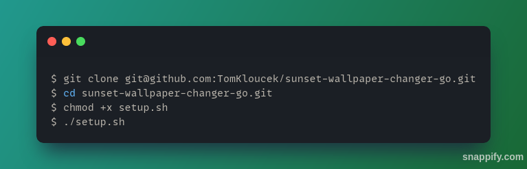

# 🌇 Sunset wallpaper changer 🌅
This project is written in Golang 🐹, and it serves as entry point for me in this language.

## Description 📝
Cmd tool which adds crontab which will change wallpaper depending on sunset and sunrise times. 🌄 🌇
## Technologies used 💻
- Go 🐹
- Bash script 📜
## Usage 🚀

## Authors 🧑‍💼
- Tomáš Klouček 👨‍💻
## Copyright ©️
[MIT](https://choosealicense.com/licenses/mit/)

Copyright © 2023 Tomáš Klouček
### Special thanks 🙏
[Sunrise-Sunset](https://sunrise-sunset.org/) - for great free api